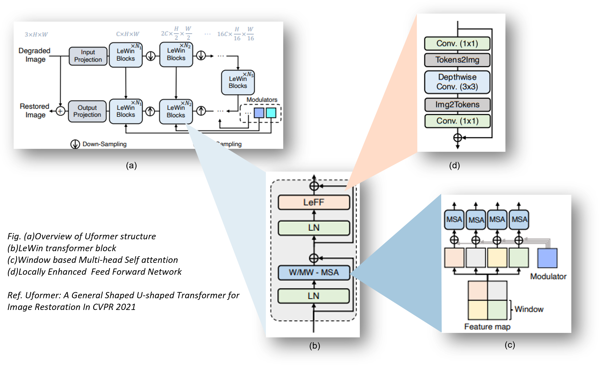

# Uformer: A General U-Shaped Transformer for Image Restoration (*Reimplemented*) 

*Re-implemented by;* Githin Kuruvanthoor Suresh
***
*Reference Paper:-* Uformer: A General U-Shaped Transformer for Image Restoration(CVPR 2022)

Paper link: [[Arxiv]](https://arxiv.org/abs/2106.03106) [[CVPR]](https://openaccess.thecvf.com/content/CVPR2022/papers/Wang_Uformer_A_General_U-Shaped_Transformer_for_Image_Restoration_CVPR_2022_paper.pdf)


<hr>


# Acknowledgment

This project is a re-implementation of the paper [Uformer: A General U-Shaped Transformer for Image Restoration](https://github.com/ZhendongWang6/Uformer), created by [Zhendong Wang](https://vinthony.github.io/), [Xiaodong Cun](https://jianminbao.github.io/), [Jianmin Bao](http://staff.ustc.edu.cn/~zhwg/), [Wengang Zhou](http://people.ucas.ac.cn/~jzliu?language=en), [Jianzhuang Liu](http://staff.ustc.edu.cn/~lihq/en/). I would like to express my heartfelt gratitude to them for their incredible work and for sharing their project as open source.

The purpose of this re-implementation was to deepen my understanding of the concepts and technologies used in the original project. It also allowed me to explore new ideas and adapt the project to suit specific needs.

While this project is based on the original, it is essential to note that it is an independent effort and not an official continuation or derivative of the original project.

The original project is licensed under the [[Arxiv]](https://arxiv.org/abs/2106.03106) [[CVPR]](https://openaccess.thecvf.com/content/CVPR2022/papers/Wang_Uformer_A_General_U-Shaped_Transformer_for_Image_Restoration_CVPR_2022_paper.pdf).


# Abstract

<p style="text-align: justify;">
The Uformer paper contributes to the field of image restoration by introducing a Transformer-based approach that leverages the strengths of self-attention mechanisms while addressing the computational challenges associated with high-resolution images. The use of non-overlapping window-based self-attention and the learnable multi-scale restoration modulator are novel contributions that enhance the capability of the Uformer model. The comprehensive experimental evaluation further strengthens the paper's scientific merit, establishing Uformer as a promising architecture for image restoration tasks.</p>



Clone the project

```bash
  git clone https://github.com/githin27/DIAG_NN_UFORMER
```

Go to the project directory & install dependencies

```bash
  cd nn_project_uformer
  !pip install -r requirements.txt
```
# Deployment

To deploy the model, go to deployment directory and load a noisy or blur image to the directory image_in.  
The pretrained weights path can be downloaded from [here](https://drive.google.com/drive/folders/1CFs1DY1U2s3sNxJIgeFZJzn8IoLvpXeG?usp=drive_link) and load it to the models directory.

```bash
  cd deploymment 
```

For image restoration run
```bash
cripts\image_restoration.sh
```
Comment or uncomment the script based your choise of operation 

You can find the result image in 
```bash
  cd image_out/denoise
  cd image_out/deblur
```


# Development
For the implementation of the model, go to development directory and run all from it
```bash
  cd development
````

## Pretrained Model

- Uformer_B: [SIDD](https://mailustceducn-my.sharepoint.com/:u:/g/personal/zhendongwang_mail_ustc_edu_cn/Ea7hMP82A0xFlOKPlQnBJy0B9gVP-1MJL75mR4QKBMGc2w?e=iOz0zz) |
[GoPro](https://mailustceducn-my.sharepoint.com/:u:/g/personal/zhendongwang_mail_ustc_edu_cn/EfCPoTSEKJRAshoE6EAC_3YB7oNkbLUX6AUgWSCwoJe0oA?e=jai90x)


## Data Preparation

### Denoising
For training data of SIDD, you can download the SIDD-Medium dataset from the [official url](https://www.eecs.yorku.ca/~kamel/sidd/dataset.php).
Then generate training patches for training by:
```python
python3 generate_patches_SIDD.py --src_dir ../SIDD_Medium_Srgb/Data --tar_dir ../datasets/denoising/sidd/train
```

For evaluation on SIDD, you can download data from [here](https://mailustceducn-my.sharepoint.com/personal/zhendongwang_mail_ustc_edu_cn/_layouts/15/onedrive.aspx?ga=1&id=%2Fpersonal%2Fzhendongwang%5Fmail%5Fustc%5Fedu%5Fcn%2FDocuments%2FUformer%2Fdatasets%2FSIDD).


### Deblurring
For training and evaluation on GoPro, you can download data from [here](https://mailustceducn-my.sharepoint.com/personal/zhendongwang_mail_ustc_edu_cn/_layouts/15/onedrive.aspx?ga=1&id=%2Fpersonal%2Fzhendongwang%5Fmail%5Fustc%5Fedu%5Fcn%2FDocuments%2FUformer%2Fdatasets%2FGoPro).  
Then put all the denoising data into `../datasets/denoising`, and all the deblurring data into `../datasets/deblurring`.

## Training

To train Uformer on SIDD for Denoising and on GoPro for Deblurring:
```sh
sh script/train_denoise.sh
sh script/train_deblur.sh
```

## Evaluation
To evaluate Uformer:

```sh
sh script/test_denoise.sh
sh script/test_deblur.sh
```

##  Results, Graph & Logs
You can fing the results, graph, logs of the pretrained model in the respective directories
```bash
  cd results
  cd graphs
  cd logs
```
